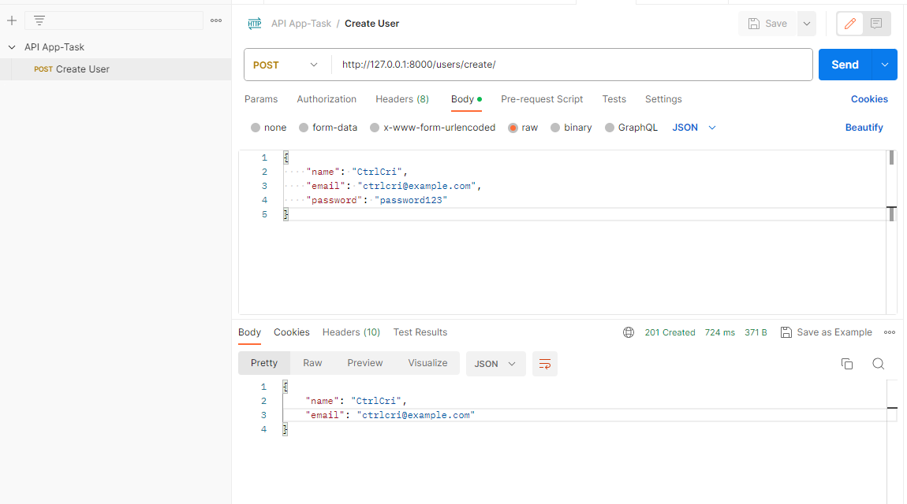
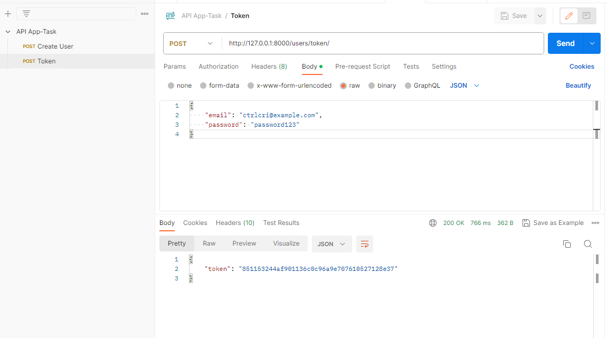
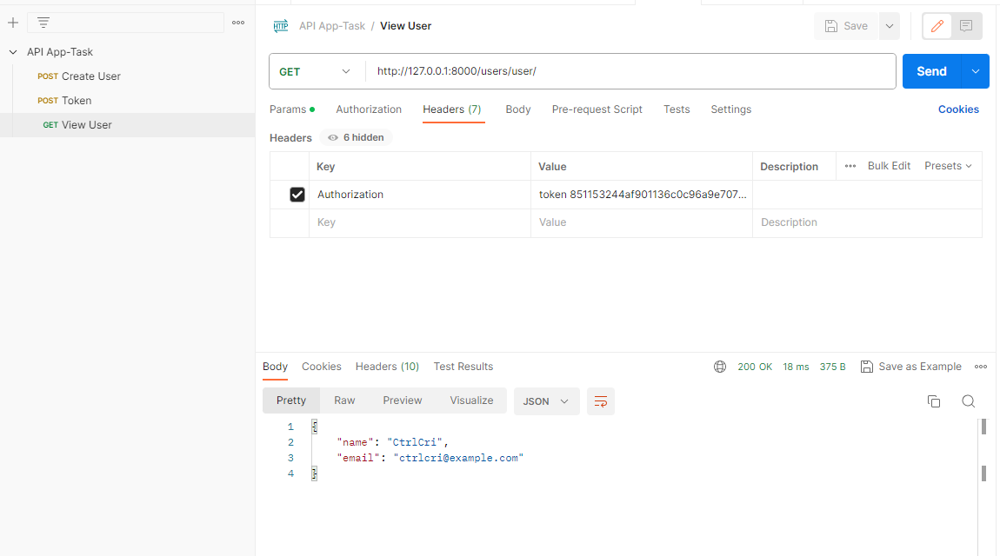
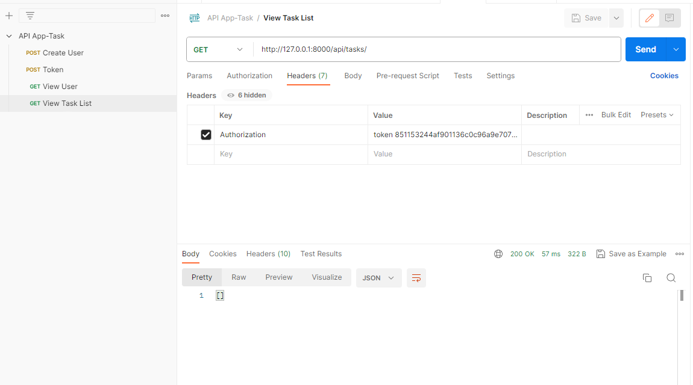
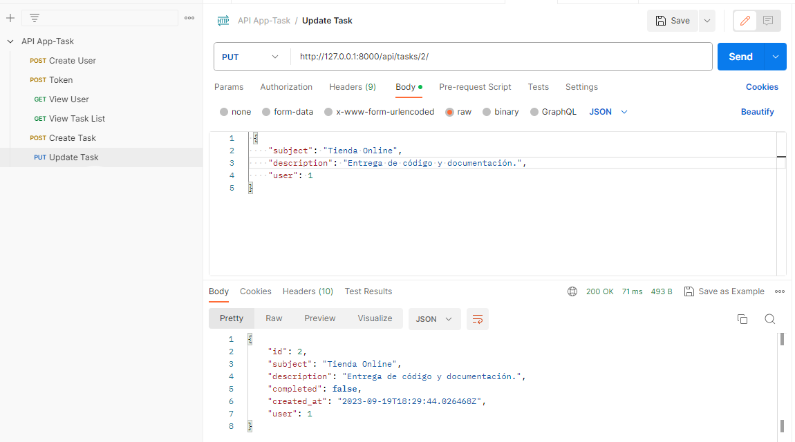
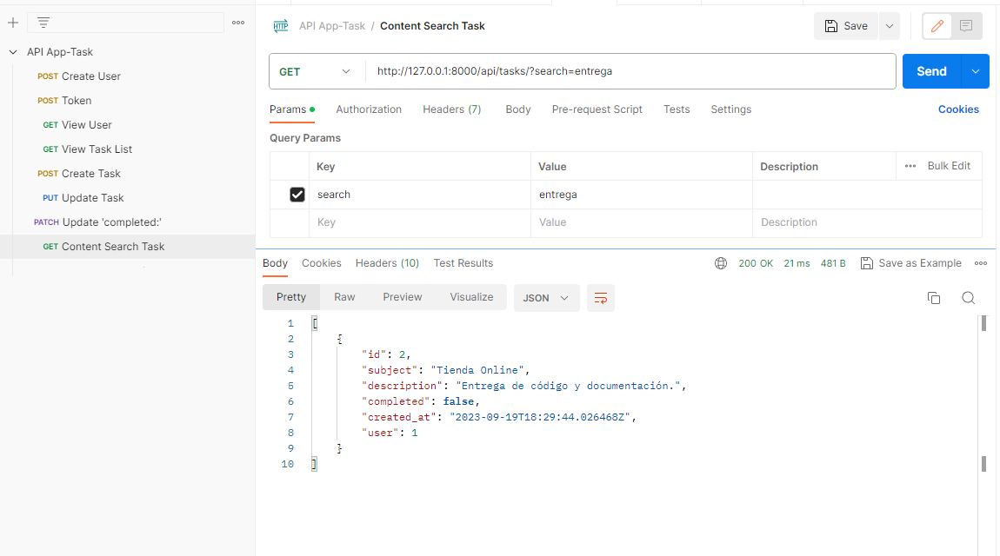
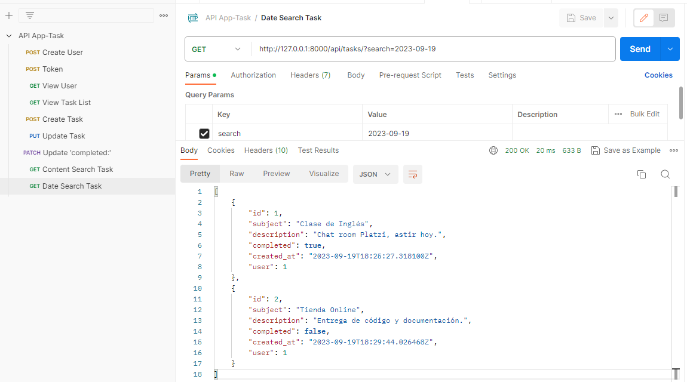
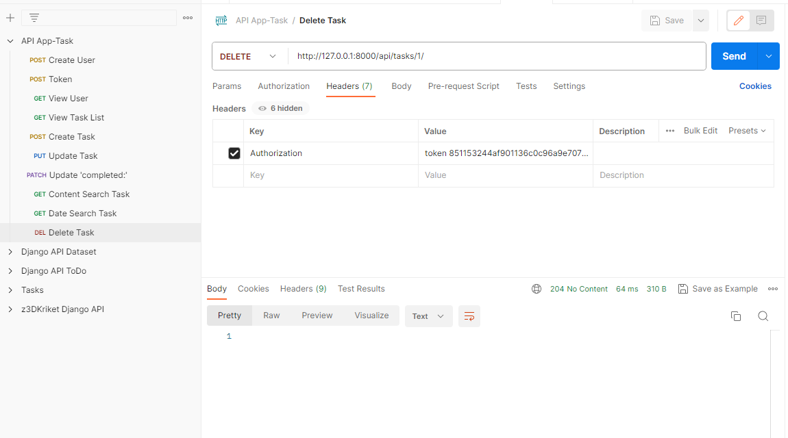

# Guía de Usuario de la API de Tareas (Task App)

¡Bienvenido a la API de Tareas (Task App)! Esta API te permite gestionar tareas y usuarios a través de una interfaz RESTful. A continuación, te proporcionamos información sobre cómo usarla.

1. Clona el repositorio de la API desde GitHub:

   ```bash
   git clone https://github.com/CtrlCri/Task-App.git

2. Navega hasta el directorio de la API:
    ```bash
   cd app

3. Inicia los contenedores de Docker utilizando Docker Compose:
    ```bash
   docker-compose up

Esto iniciará la API y una base de datos PostgreSQL en contenedores de Docker.  

La API estará disponible en http://localhost:8000.

# Endpoints

## Usuarios

- **Crear Usuario**: `POST /users/create/`
  - Crea un nuevo usuario proporcionando un JSON con `name`, `email` y , `password`.
- **Obtener Token**: `POST /users/token/`
  - Obten un token de autorización proporcionando un JSON con `email` y , `password`.
- **Listar Usuarios**: `GET /users/user/`
  - Obtiene una lista de todos los usuarios registrados.

## Tareas

- **Crear Tarea**: `POST /api/tasks/`
  - Crea una nueva tarea proporcionando un JSON con `subjet`, `description` y `user`.
- **Listar Tareas**: `GET /api/tasks/`
  - Obtiene una lista de todas las tareas registradas proporcionando el token de autorización.
- **Actualizar Tarea**: `PUT /api/tasks/{id}/`
  - Actualiza el  total o parcialmente cualquier campo de una tarea por su ID.
- **Actualizar Tarea completada**: `PATCH /api/tasks/{id}/`
  - Actualiza el estado de una tarea por su ID.
- **Buscar Contenido**: `GET /api/tasks/?search=value`
  - Busca una palabra en el contenido de una tarea en la lista de tareas.
- **Buscar por Fecha**: `GET /api/tasks/?search=date`
  - Busca en una fecha especifica las tareas en la lista de tareas.
- **Eliminar Tarea**: `DELETE /api/tasks/{id}/`
  - Elimina una tarea por su ID.

# Ejemplos de Solicitudes

  

  

  

   

  

  

  

  

  

  
